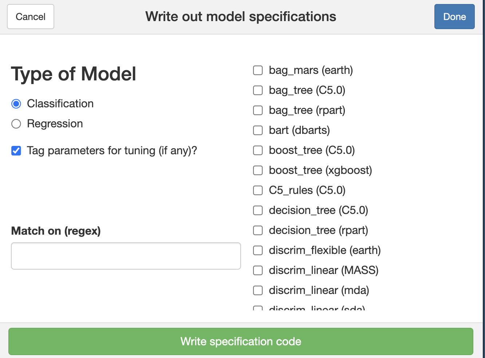

```{r setup, include=FALSE}
library(kableExtra)
knitr::opts_chunk$set(comment = '')
```

This post presents an example of using workflow sets in the `tidymodels` framework with cross-validation and varying recipes and models.

The dataset in use is Pima Indians Diabetes. [The previous post](https://www.q5bt.com/welcome-r-starter-analysis-of-pima-indians-diabetes-dataset/) established the baseline accuracy of 73%. The goal for this time is to improve upon this number.

## Preliminary

This section contains a copy of the previously done analysis. In short, it loads the data, renames the outcome variable, and replaces zeros with missing values.

```{r message=FALSE, fig.width=12, fig.align='center'}
library(tidyverse)
library(tidymodels)
set.seed(0)

clean <- function(data) {
  data |> 
    mutate(
      bmi = na_if(bmi, 0),
      diastolic_blood_pressure = na_if(diastolic_blood_pressure, 0),
      plasma_concentration = na_if(plasma_concentration, 0),
      serum_insulin = na_if(serum_insulin, 0),
      triceps_skinfold_thickness = na_if(triceps_skinfold_thickness, 0),
    )
}

visualise <- function(data) {
  data |> 
    pivot_longer(
      cols = 1:8,
      names_to = "measurement",
      values_to = "value",
    ) |> 
    filter(!if_any(everything(), is.na)) |> 
    ggplot(aes(x = value, fill = is_diabetic)) + 
    geom_histogram(bins = 50, position = "dodge") +
    facet_wrap(~measurement, nrow = 2, ncol = 4, scales = "free") +
    labs(
      title = "Distribution of Eight Health Measurements by Diabetes Status",
      x = "Value",
      y = "Count",
      fill = "Diabetic?",
    )
}

data_raw <- read_csv('./data/pima-indians-diabetes-data.csv')
data <- data_raw |> 
  mutate(
    class = factor(class, levels = c("1", "0"), labels = c("Yes", "No"))
  ) |> 
  rename(
    is_diabetic = class
  ) |> 
  clean()

visualise(data)
```

## Cross-validation

Cross-validation is a technique which enables experimenting with many different models and pre-processing steps while ensuring that the results generalise.

The basic modelling setup of fitting a model to the train partition and evaluating it on the test partition fails with repeated experimentation. The risk of overfitting to the test partition increases as more models are tried, making performance estimates unreliable.

Cross-validation solves this by minimising the use of the test partition. In the simplest case (many alternative approaches exist), it divides the train partition into a number `n` of folds (`n = 10` in the code below). Each model is trained on `n-1` folds and evaluated on the remaining `n`th fold to get a total of `n` performance estimates. Once the best model is identified, it is trained on the whole of train partition and evaluated one final time on the test partition.

```{r}
data_split <- initial_split(
  data,
  prop = 0.75,
  strata = is_diabetic
)

data_train <- training(data_split)
data_folds <- vfold_cv(
  data_train,
  v = 10,
  strata = is_diabetic
)
data_test <- testing(data_split)

metrics <- metric_set(accuracy, precision, recall)
```

## Models

In `tidymodels`, the package that provides a standardised interface to specifying machine learning models is `parsnip`.

Many models are supported. They can be accessed by running the `parsnip_addin` function, which brings a graphical interface to browse models and generate specifications for them:

```{r echo=FALSE}

```

Here is a list of five selected models to try:

```{r}
boost_tree_model <- boost_tree() |> 
  set_engine("xgboost") |> 
  set_mode("classification")

logistic_reg_model <- logistic_reg() |> 
  set_engine("glm") |> 
  set_mode("classification")

decision_tree_model <- decision_tree() |> 
  set_engine("rpart") |> 
  set_mode("classification")

rand_forest_model <- rand_forest() |> 
  set_engine("ranger") |> 
  set_mode("classification")

svm_linear_model <- svm_linear() |> 
  set_engine("kernlab") |> 
  set_mode("classification")

na_robust_specifications <- list(
  boost_tree_model,
  logistic_reg_model,
  decision_tree_model,
  rand_forest_model
)

na_sensitive_specifications <- list(
  svm_linear_model
)
```

## Recipes

In `tidymodels`, recipes encapsulate data pre-processing steps. They also ensure that train and test partitions are treated correctly: pre-processing parameters (if any) are estimated from the train partition and applied unchanged to the test partition.

In the case of the Pima Indians Diabetes dataset, recipes help dealing with missing values, also known as NAs, which stands for "Not Available".

Here are two recipes to try:

- Null recipe: no pre-processing but can only be used with NA-robust models.
- Imputer recipe: replace NAs with the median of the respective measurement and add an indicator column to mark that observation.

```{r}
null_recipe <- recipe(
  is_diabetic ~ .,
  data = data_train
)

imputer_recipe <- recipe(
  is_diabetic ~ .,
  data = data_train
) |>
  step_indicate_na(
    bmi,
    diastolic_blood_pressure,
    plasma_concentration,
    serum_insulin,
    triceps_skinfold_thickness,
  ) |>
  step_impute_median(
    bmi,
    diastolic_blood_pressure,
    plasma_concentration,
    serum_insulin,
    triceps_skinfold_thickness,
  )
```

## Bringing It All Together

Now that the recipes and model specifications are defined, they can be combined into workflows. In `tidymodels`, workflows encapsulate the whole modelling process - from raw data to a fitted model.

```{r}
workflows <- rbind(
  workflow_set(
    preproc = list(impute = imputer_recipe),
    models = na_sensitive_specifications
  ),
  workflow_set(
    preproc = list(null = null_recipe, impute = imputer_recipe),
    models = na_robust_specifications
  )
)

fits <- workflows |>
  workflow_map(
    "fit_resamples",
    resamples = data_folds,
    metrics = metrics
  )

fits |>
  collect_metrics() |>
  filter(.metric == 'accuracy') |>
  arrange(desc(mean)) |>
  select(wflow_id, mean, std_err) |> 
  knitr::kable(digits = 4) |> 
  kable_styling(full_width = FALSE)
```

```{r fig.width=12, fig.align='center'}
fits |>
  collect_metrics() |>
  ggplot(aes(x = mean, y = wflow_id, colour = `.metric`)) +
  geom_point() +
  geom_errorbar(aes(xmin = mean - std_err, xmax = mean + std_err), width = 0.2) +
  scale_x_continuous(breaks = seq(0.46, 0.80, by = 0.02)) +
  labs(
    title = "Accuracy, Precision, and Recall Estimates from 10-Fold Cross-Validation for 5 Models and 2 Recipes",
    y = "Model",
    x = "Mean",
    colour = "Metric"
  ) +
  theme(plot.margin = margin(30, 30, 30, 30), legend.position = "bottom")
```

The best model, as judged by mean accuracy estimate, is linear SVM with null values imputation. Its performance on the test partition, as measured by accuracy, is 75.5%.

```{r}
best_model <- svm_linear_model

best_model_workflow <- workflow() |>
  add_recipe(imputer_recipe) |>
  add_model(best_model)

final_fit <- best_model_workflow |>
  fit(data = data_train)

augment(final_fit, new_data = data_test) |>
  conf_mat(truth = is_diabetic, estimate = .pred_class) |>
  autoplot(conf_matrix, type = "heatmap") +
  labs(title = "Linear SVM Confusion Matrix") +
  theme(plot.title = element_text(hjust = 0.5))

augment(final_fit, data_test) |>
  metrics(truth = is_diabetic, estimate = .pred_class) |> 
  knitr::kable(digits = 4) |> 
  kable_styling(full_width = FALSE)
```

## Conclusion

This post has showcased an example usage of workflow sets - a `tidymodels` technique to varying both recipes and models.

The best out of 9 fits resulted in a prediction accuracy increase, as estimated on the test partition, from 73% to 75.5%.

A few simplications that may need to revisited in the future include:

- Not evaluating whether accuracy is a suitable metric to try to improve.
- Not dealing with model parameters yet.
- Not dealing with scaling, normalising, or outliers yet.
